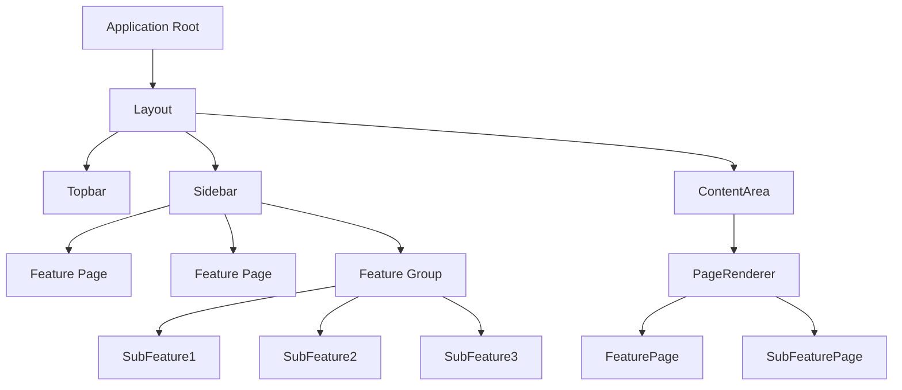
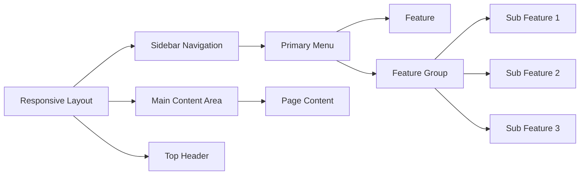
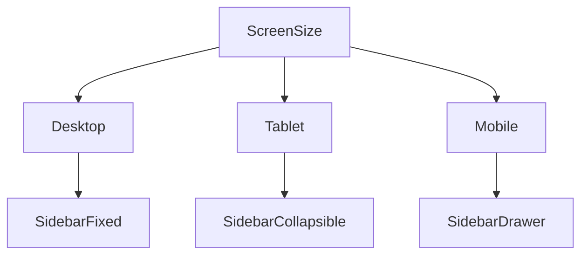

# Product Requirement Diagram – shadcn Homepage with Sidebar

## Overview

A responsive web application homepage built with **shadcn/ui** that includes a persistent sidebar navigation. The sidebar supports nested menus representing features and subfeatures. Each feature can correspond to a page or module within the application.

The layout must support both **desktop and mobile responsiveness**, collapsing the sidebar into a drawer on smaller screens.

---

## High-Level Architecture



---

## UI Layout Structure



---

## Navigation Model

Sidebar navigation structure:

* Dashboard
* Feature A
* Feature B
* Feature Group

  * Sub Feature 1
  * Sub Feature 2
  * Sub Feature 3

Each **feature or subfeature corresponds to a page route**.

Example:

```
/dashboard
/feature-a
/feature-b
/feature-group/subfeature-1
/feature-group/subfeature-2
```

---

## Mobile Responsiveness

Behavior:

* **Desktop**

  * Sidebar visible
  * Nested menus expandable

* **Tablet**

  * Sidebar collapsible

* **Mobile**

  * Sidebar becomes a drawer
  * Accessible via hamburger button



---

## Feature Expansion Model

Every new feature added to the application should follow this structure:

```
Feature
 ├─ Page
 ├─ Components
 ├─ Subfeatures
 │   ├─ Page
 │   └─ Components
```

When a new feature or subfeature is created:

1. Create a page
2. Register route
3. Add menu entry in sidebar

---

## Sidebar Data Model

Example configuration-driven menu system:

```ts
const sidebarMenu = [
  {
    title: "Dashboard",
    path: "/dashboard"
  },
  {
    title: "Feature A",
    path: "/feature-a"
  },
  {
    title: "Feature Group",
    children: [
      {
        title: "Sub Feature 1",
        path: "/feature-group/subfeature-1"
      },
      {
        title: "Sub Feature 2",
        path: "/feature-group/subfeature-2"
      }
    ]
  }
]
```

---

## Routing Logic

```
Route -> Page -> Feature Module
```

Example:

```
/feature-group/subfeature-1
        ↓
SubFeaturePage
        ↓
SubFeature Module
```

---

## shadcn Components Used

* Sidebar
* Sheet (mobile drawer)
* Button
* NavigationMenu
* Accordion (for nested menu)
* ScrollArea

---

## Key Requirements

### Functional

* Sidebar navigation with nested menu
* Feature pages
* Subfeature pages
* Responsive layout
* Dynamic routing

### Non Functional

* Mobile responsive
* Config-driven menu
* Easily extensible
* Clean component architecture

---

## Future Enhancements

* Role based menu visibility
* Search in sidebar
* Recently visited pages
* Plugin-based feature modules
